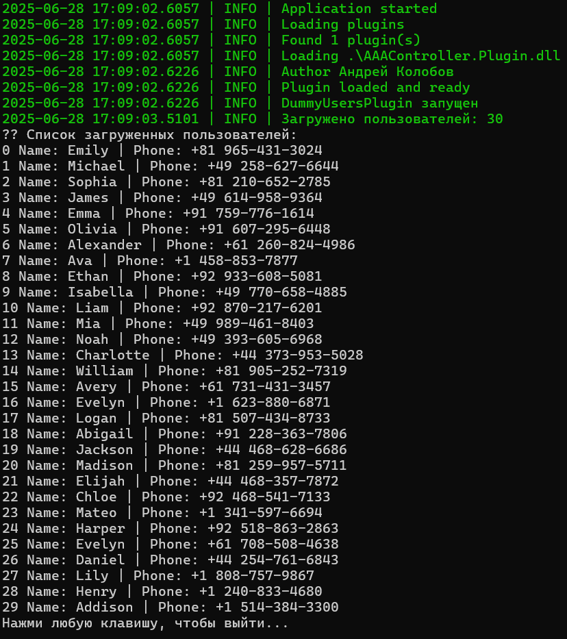

# AAAController.Plugin

### 📦 Назначение
Плагин для приложения, автоматически загружающий список пользователей из публичного API [https://dummyjson.com/users](https://dummyjson.com/users) при запуске программы.

---

### 🔧 Функциональность

- Загружает 30 пользователей из внешнего API.
- Формирует список объектов `EmployeesDTO`.
- Выводит полученных пользователей в консоль.
- Использует встроенный `Logger` из `PhoneApp.Domain` для вывода логов.
- Работает как плагин, полностью совместимый с архитектурой PhoneApp.
  

---

### 💻 Установка и запуск

1. Убедитесь, что скачали и распаковали проект.
2. Запустите `PhoneApp.exe`.
3. В логах вы увидите:
   - Подключение плагина.
   - Загрузку пользователей.
   - Список всех загруженных пользователей.

---

### 🔗 Зависимости

- .NET Framework 4.7.2
- Newtonsoft.Json
- System.Net.Http
- NLog

---

Если при запуске PhoneApp.exe вы видите такую ошибку:

ERROR | Не удалось загрузить файл или сборку "...AAAController.Plugin.dll" либо одну из их зависимостей. Операция не поддерживается. (Исключение из HRESULT: 0x80131515)
🧾 Причина:
Это происходит, если плагин (.dll) был скачан из интернета, и Windows заблокировала его запуск по соображениям безопасности.

✅ Как исправить:
Перейдите в папку где лежит AAAController.Plugin.dll

Кликните правой кнопкой мыши по файлам с расширением .dll → Свойства

Внизу окна появится надпись "Разблокировать" с галочкой — поставьте галочку ✅

Нажмите Применить и ОК

Перезапустите PhoneApp.exe

⚠️ Если это не помогает — убедитесь, что версия .NET Framework проекта соответствует версии PhoneApp (обычно 4.7.2 или 4.8).

### 👨‍💻 Автор

> Андрей Колобов, 2025  
> Плагин разработан в рамках тестового задания.
